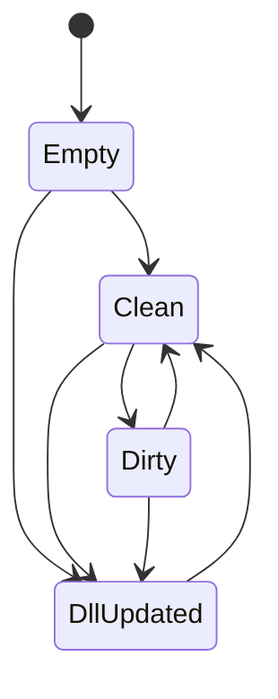

# Romanesco2

Romanescoの反省点を活かしてラクに作る方法を探る。

長期間プロジェクトを離れたり、プロジェクトを放棄してしまった後に読み返せるよう、思想や設計を記す。

前作Romanescoのことを以後 [1] と書くことにする。

# 雑記

## ValueNode

[1]のValueStorageはオブジェクトを直接参照していた。
これにより、親オブジェクトが子オブジェクトを本当に参照しているのかを保証できなかった。

たとえば、親オブジェクトのValueStorageがオブジェクトAを、子オブジェクトのValueStorageがオブジェクトBを参照していたら、オブジェクトAはオブジェクトBを参照しているはずだが、実際にはAがBを参照していないことがあった。これはBを書き換えたはずがAに反映されないなどのバグの温床だった。

また、オブジェクトを保持する都合上、DLLを読み込みっぱなしにしなければいけなかった。これだとRomanescoの起動中はデータDLLのビルドができない不都合があった。

また、オブジェクトをデシリアライズして読み込むとき、読み込んだデータを初期値などで上書きしないよう気を付けるのがModelFactoryの責務になっており、ミスを誘っていた。

さらに、開発中に「インスタンスをコピー＆ペーストしたい」という欲求が生まれたが、これも妨げた。

[1]の戦略には、シリアライズ時にオブジェクトのルートを直接シリアライザに読ませればよいという簡便さがあったが、それ以外のデメリットが許容できなかった。

そこで代替案として、オブジェクトへの参照を持たずにオブジェクトの構造だけを表すValueNodeクラスを作り、クラスobjectやリストList<object>の生データを持つのはやめて、プリミティブ型だけを保持するようにしたい。

データDLLを読み込む際に構造を決め、その後プロジェクトjsonからデータを読み込む。新しくDLLに増えたデータには初期値を代入し、DLLから削除されたデータはプロジェクトからも削除する。

---

あるいは、これらの設計を採用することでValueStorageに相当する層が不要になるかもしれない。ValueStorageの本来の目的は、FieldInfo, PropertyInfoに対していつでも同じ手順でget/setできるようにすることだったので、インスタンスを直接保持せず構造だけを持つ新しい設計ではModel系クラスの層だけで実現できるかもしれない。

## ModelFactory

ModelFactoryという考え方は上手くいっていたと思う。FactoryパターンとResponsibilityChainパターンを上手く組み合わせていた。

一方で、ValueNodeの設計を活かすため、ModelFactoryにも変化が必要だ。具体的には、インスタンスをis演算子で解析してModelを構築していた従来の設計を見直し、Typeクラスの情報を見てリフレクションでもってValueNodeの構築方法を決める。これにより、クラスをインスタンス化できない局面(CPUプラットフォームが違うなど)でもメタデータのみで構造を決定できる。

## データモデルプロジェクト

今までモデル側は、 `Common.Model`, `Model`, `BuiltinPlugin.Model` に分かれていたが、これらを全て合わせないとプリミティブ型のサポートが得られなかったり、データの読み込み・書き出しができなかったりした。また、 `Model` はデータの管理だけではなくエディタの状態やコマンドの管理も担っていた。

今後は、エディタの状態やコマンドを管理する `EditorModel` と、データ構造を管理する `DataModel` に分けたい。

これにより、Romanesco2が頓挫したとしても `DataModel` は使いまわせる可能性が上がる。使いまわしの都合上、 `DataModel` は優先的に単体テストを書くべきである。

## Listモデル

Listモデルはその子要素たちにアクセスする際、インデクサを用いていた。これは引数なしgetter/setterを前提としていたValueStorageを使うことを難しくしていた。

そこで、Listモデルから直接ValueNodeを持つのをやめて、Listモデル→ListItemモデル→ValueNode という3層構造を構築する。これにより、Listモデルから要素が追加/削除されても、ListItemモデルが指すオブジェクトの指定方法は変わらない。

## シリアライズ

[1]ではインスタンスそのものをシリアライズしていたため、インスタンスが生成できない状況下ではRomanescoを使えなかった。代替案として、シリアライズ用のRomanesco独自のクラスを定義する。

例えば、 `int` に対しては `IntModel` があるが、シリアライズ用の `SerializedInt` もある。
`class` に対しては `ClassModel` があるが、シリアライズ用の `SerializedClass` もある。

各Modelクラスは `LoadValue` メソッドを持ち、Serializedクラスのデータを読み込む方法を心得ている。

## テスト

構造のテストをしやすくしたい。以下のような書き方ができるとどうか：

```csharp
model.BeginAssertion()
    .NotNull()
    .AssertType<ClassModel>()
    .Extract(out var root);
    
using (var members = root.AssertSequence(x => x.Children))
{
    members.Next()
        .AssertType<ArrayModel>()
        .AssertEmpty(x => x.Items.ToArray());
        .Equals("Ints", x => x.Title)
        .Extract(out var array);

    array.Select(x => x.Prototype)
        .AssertType<IntModel>()
        .Equals("Prototype(Ints)", x => x.Title);
}
```

# ロードマップ

## データを解析できるようにする

int, bool, string, floatなどのデータを解析し、Modelクラスに変換できるようにする。
また、これらをメンバーに持つクラスを解析できるようにする。

# 懸念点

ユーザー定義の形式でデータを出力する際、ユーザーDLLを読み込む必要がある。

データ編集時に使っていたDLLとデータ出力時に使うDLLのバージョンが違う場合、特にシリアライズ方法が変わっている場合どうすればいいか？

データ出力前に必ず保存を挟むようにする。その後、いったん `DllUpdated` 状態に遷移する。この状態ではモーダルダイアログが表示されるため編集や保存が不可で、正しいDLLを読み込むことができたら `Clean` 状態へ戻って作業を続行できる。モーダルダイアログが表示される状態なので、状態遷移図に書かなくてもいいかもしれない。

