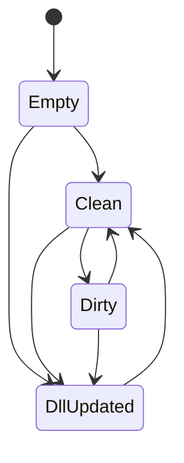

# Romanesco2

Romanescoの反省点を活かしてラクに作る方法を探る。

長期間プロジェクトを離れたり、プロジェクトを放棄してしまった後に読み返せるよう、思想や設計を記す。

前作Romanescoのことを以後 [1] と書くことにする。

# 雑記

## ValueNode

[1]のValueStorageはオブジェクトを直接参照していた。
これにより、親オブジェクトが子オブジェクトを本当に参照しているのかを保証できなかった。

たとえば、親オブジェクトのValueStorageがオブジェクトAを、子オブジェクトのValueStorageがオブジェクトBを参照していたら、オブジェクトAはオブジェクトBを参照しているはずだが、実際にはAがBを参照していないことがあった。これはBを書き換えたはずがAに反映されないなどのバグの温床だった。

また、オブジェクトを保持する都合上、DLLを読み込みっぱなしにしなければいけなかった。これだとRomanescoの起動中はデータDLLのビルドができない不都合があった。

また、オブジェクトをデシリアライズして読み込むとき、読み込んだデータを初期値などで上書きしないよう気を付けるのがModelFactoryの責務になっており、ミスを誘っていた。

さらに、開発中に「インスタンスをコピー＆ペーストしたい」という欲求が生まれたが、これも妨げた。

[1]の戦略には、シリアライズ時にオブジェクトのルートを直接シリアライザに読ませればよいという簡便さがあったが、それ以外のデメリットが許容できなかった。

そこで代替案として、オブジェクトへの参照を持たずにオブジェクトの構造だけを表すValueNodeクラスを作り、クラスobjectやリストList<object>の生データを持つのはやめて、プリミティブ型だけを保持するようにしたい。

データDLLを読み込む際に構造を決め、その後プロジェクトjsonからデータを読み込む。新しくDLLに増えたデータには初期値を代入し、DLLから削除されたデータはプロジェクトからも削除する。

---

あるいは、これらの設計を採用することでValueStorageに相当する層が不要になるかもしれない。ValueStorageの本来の目的は、FieldInfo, PropertyInfoに対していつでも同じ手順でget/setできるようにすることだったので、インスタンスを直接保持せず構造だけを持つ新しい設計ではModel系クラスの層だけで実現できるかもしれない。

## ModelFactory

ModelFactoryという考え方は上手くいっていたと思う。FactoryパターンとResponsibilityChainパターンを上手く組み合わせていた。

一方で、ValueNodeの設計を活かすため、ModelFactoryにも変化が必要だ。具体的には、インスタンスをis演算子で解析してModelを構築していた従来の設計を見直し、Typeクラスの情報を見てリフレクションでもってValueNodeの構築方法を決める。これにより、クラスをインスタンス化できない局面(CPUプラットフォームが違うなど)でもメタデータのみで構造を決定できる。

## データモデルプロジェクト

今までモデル側は、 `Common.Model`, `Model`, `BuiltinPlugin.Model` に分かれていたが、これらを全て合わせないとプリミティブ型のサポートが得られなかったり、データの読み込み・書き出しができなかったりした。また、 `Model` はデータの管理だけではなくエディタの状態やコマンドの管理も担っていた。

今後は、エディタの状態やコマンドを管理する `EditorModel` と、データ構造を管理する `DataModel` に分けたい。

これにより、Romanesco2が頓挫したとしても `DataModel` は使いまわせる可能性が上がる。使いまわしの都合上、 `DataModel` は優先的に単体テストを書くべきである。

## Listモデル

Listモデルはその子要素たちにアクセスする際、インデクサを用いていた。これは引数なしgetter/setterを前提としていたValueStorageを使うことを難しくしていた。

そこで、Listモデルから直接ValueNodeを持つのをやめて、Listモデル→ListItemモデル→ValueNode という3層構造を構築する。これにより、Listモデルから要素が追加/削除されても、ListItemモデルが指すオブジェクトの指定方法は変わらない。

## シリアライズ

[1]ではインスタンスそのものをシリアライズしていたため、インスタンスが生成できない状況下ではRomanescoを使えなかった。代替案として、シリアライズ用のRomanesco独自のクラスを定義する。

例えば、 `int` に対しては `IntModel` があるが、シリアライズ用の `SerializedInt` もある。
`class` に対しては `ClassModel` があるが、シリアライズ用の `SerializedClass` もある。

各Modelクラスは `LoadValue` メソッドを持ち、Serializedクラスのデータを読み込む方法を心得ている。

## テスト

構造のテストをしやすくしたい。以下のような書き方ができるとどうか：

```csharp
model.BeginAssertion()
    .NotNull()
    .AssertType<ClassModel>()
    .Extract(out var root);
    
using (var members = root.AssertSequence(x => x.Children))
{
    members.Next()
        .AssertType<ArrayModel>()
        .AssertEmpty(x => x.Items.ToArray());
        .Equals("Ints", x => x.Title)
        .Extract(out var array);

    array.Select(x => x.Prototype)
        .AssertType<IntModel>()
        .Equals("Prototype(Ints)", x => x.Title);
}
```

## プロジェクト依存関係

プロジェクトの依存関係をサポートしようとすると複雑になる。依存先のDLLの存在も確認しないといけない。

実のところ、プロジェクトの依存関係をサポートしても使い道がセーブデータの初期値くらいしかなかった。そういったデータはデータベースに埋め込んでも構わないはず。

## モデルのプラグイン

プラグインでデータモデルを追加できるようにする必要性をあまり感じなかった。

## インライン/ブロックの呼び分け

DataTemplateSelectorとDependencyPropertyを組み合わせる。

DependencyProperty `Layout` を作成し、 `Layout` が `Inline` である場合と `Block` である場合で DataTemplateSelector `FieldViewTemplateSelector` の中で分岐する。

プラグインは、InlineであるときとBlockであるときの見た目を `FieldViewTemplateSelector` に登録できる。

`Layout` を指定していないビューは、 `Inline` にも `Block` にも同じ見た目の、指定されたビューのうち最初のものが使われる。

## ID参照

モデルから見ると、ID参照は単なるintやstringに過ぎない。

これをビュー上で参照のように提示したいのであれば、そのサポートはViewModel以上の部分でやるべき。

それから、参照先を次のブロックで編集できる機能が欲しい。

# ロードマップ

## ✅ データを解析できるようにする

int, bool, string, floatなどのデータを解析し、Modelクラスに変換できるようにする。
また、これらをメンバーに持つクラスを解析できるようにする。

## 🚧 DLLを読み込んでプロジェクトを作成できるようにする

まず、Hostプロジェクトを作る。プロジェクトの作成、管理、プラグインの読み込みはHostの管轄。

エディターは最初空っぽ。DLLを読み込むとデータがある状態に遷移する。最初は画面に読み込んだデータの文字列形式を表示するのみにする。
空っぽのときは、画面中央に「プロジェクトを作成するか開いてください」と表示する。

Host.csproj
└─Views
  └─MainWindow
└─ViewModels
  └─EditorViewModel
└─Hosting
  └─PluginHost

## 🚧 ビューを作る

### 🚧 1階層だけの場合の実装を作る

int, bool, string, float, class, array, reference, subtyping のビューを作る。

ViewModel~Viewはプラグインで実装する。DataTemplateSelectorをうまく活用すること。

```csharp
public class PluginsDataTemplateSelector
{
    public DataTemplate? GetTemplate(IDataViewModel vm, DepdendencyObject sender)
    {
        if (vm is IntViewModel) return new DataTemplate("int用のテンプレート...");
    }
}
```

### 🚧 Editコマンドを作って任意の階層を作れる

class, arrayなどは編集ボタンを押すと編集ブロックが開いて編集できる。

## 🚧 プラグインから見たModel

DataModelがReactivePropertyに依存しないようになれば、プラグイン側もReactivePropertyを気にせずに済むので得。

プラグイン側で ReactiveProperty の知識を不要にするだけであれば、ReactiveProperty版と素直なバージョンを両方提供すればいい気もする。
例えば IntModel は、 ReactiveProperty<int> 型のプロパティと int 型のプロパティをどちらも提供する。

## 🚧 継承のサポート

継承のサポートはモデルの役目。

SubtypingModel は SubtypeOptions クラスを持ち、 SubtypeOptions は NullOption または JustOption のリストを持つ。 SubtypeOptions は複数の SubtypingModel 間で共有される。

## 🚧 コマンドサポート

データDLLで拡張メソッドを使ってコマンドを追加できるようにしたい。

```csharp
[EditorCommandSource]
public static class Commands
{
    // 第一引数が T で、戻り値も同じ T であるようなstaticメソッドがコマンドとして利用できる。
    [Name("ID自動設定")]
    public static MyType[] UpdateId(this MyType[] source)
    {
        return source.Select((x, i) => source with { Id = i }).ToArray();
    }
}
```

実行するとDecodeが走り、それを引数に次にコマンドが実行され、その戻り値を使って最後にLoadValueする。

## 🚧 ローカライズサポート

Name属性をつけると、エディター上で表示するときのメンバー名を設定できる。
第二引数はoptionalで、ローカライズするときに使うKeyを指定できる。デフォルトでJP。

```csharp
public class Hoge
{
    [Name("識別子", JP)]
    public string Id { get; set; }
}
```

# 懸念点

ユーザー定義の形式でデータを出力する際、ユーザーDLLを読み込む必要がある。

データ編集時に使っていたDLLとデータ出力時に使うDLLのバージョンが違う場合、特にシリアライズ方法が変わっている場合どうすればいいか？

データ出力前に必ず保存を挟むようにする。その後、いったん `DllUpdated` 状態に遷移する。この状態ではモーダルダイアログが表示されるため編集や保存が不可で、正しいDLLを読み込むことができたら `Clean` 状態へ戻って作業を続行できる。モーダルダイアログが表示される状態なので、状態遷移図に書かなくてもいいかもしれない。



## エクスポートの懸念

従来のインスタンスを保持する方法は使わないので、シリアライズ時には構造をエクスポート先の型に変換する方法が必要になる。

SerializedData -> IDataModel
IDataModel -> SerializedData

の変換があるのと同様に、

SerializedData -> <ユーザー定義型>

の変換ができなければならない。リフレクションで頑張ることになる。
ただそうすると、ユーザー定義型をインスタンス化可能でないといけない。
CPUプラットフォームが異なる場合などで不可能な場合がある。

どのみち、エディターからユーザー定義のメソッドを呼んだりプラグインをサポートしたりを考えると、CPUプラットフォームの縛りはあって然るべきか。

## スタイルの懸念

`Title: [form]` というような見た目のGUIを生成するテンプレートがあったが、Resourcesをマージする手段に手こずっていた。C#マークアップではそもそも同じことをどのようにすればできるのかが分からない。C#マークアップにしか共通スタイルを提供しないという手もある。