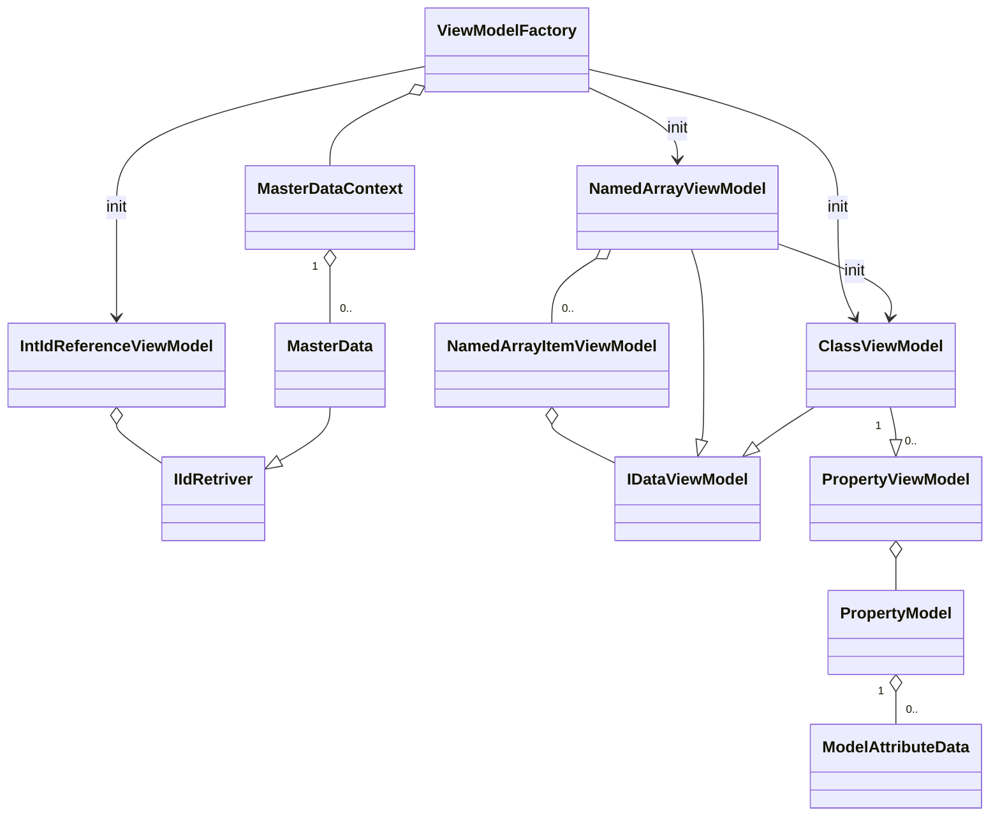
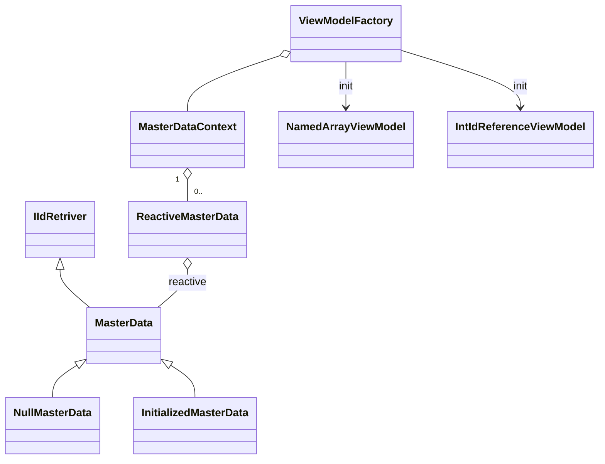

```mermaid
classDiagram-v2
    IntIdReferenceViewModel o-- IIdRetriver
    NamedArrayViewModel "1" o-- "0.." NamedArrayItemViewModel
    NamedArrayItemViewModel o-- IDataViewModel
    NamedArrayViewModel --|> IDataViewModel
    ClassViewModel --|> IDataViewModel
    ClassViewModel "1" --|> "0.." PropertyViewModel
    PropertyViewModel o-- PropertyModel
    PropertyModel "1" o-- "0.." ModelAttributeData

    MasterData --|> IIdRetriver
    MasterDataContext "1" o-- "0.." MasterData

    ViewModelFactory o-- MasterDataContext
    ViewModelFactory --> NamedArrayViewModel : init
    ViewModelFactory --> ClassViewModel : init
    ViewModelFactory --> IntIdReferenceViewModel : init

    NamedArrayViewModel --> ClassViewModel : init
```

```mermaid
classDiagram-v2
    MasterData <|-- NullMasterData
    MasterData <|-- InitializedMasterData
    IIdRetriver <|-- MasterData
    MasterDataContext "1" o-- "0.." ReactiveMasterData

    ReactiveMasterData o-- MasterData : reactive

    ViewModelFactory o-- MasterDataContext
    ViewModelFactory --> NamedArrayViewModel : init
    ViewModelFactory --> IntIdReferenceViewModel : init
```